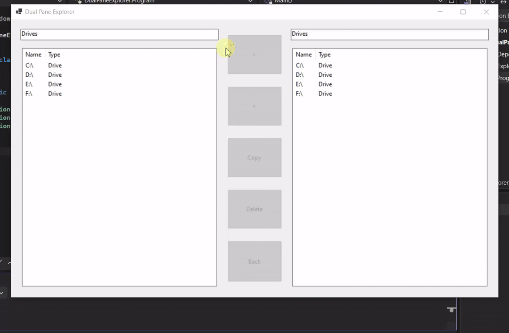

## Lab 9 of the C# course: Windows File Manager

## Description
A Windows File Manager application featuring a dual-pane interface for browsing and managing files and directories.

## Quick demo:

### Features

**Initial State**
- Two identical panes displaying all computer drives
- Text box above each pane showing the current path

**Navigation**
- **Single Click**: Selects an item in either pane
- **Double Click**: 
    - On folders: Opens the folder and displays its contents (folders first, then files) with the full path shown in the text box above
    - On files: Displays a message indicating it's a file (Optional: Open with associated application or execute if it's an executable)
- **"." Item**: Returns one level up in the directory hierarchy
- **".." Item**: Returns to the drives view

**File Operations**

- **">" Button**: Moves selected item from left pane to the current directory in right pane (Optional: Disabled when right pane shows drives)
- **"<" Button**: Moves selected item from right pane to the current directory in left pane (Optional: Disabled when left pane shows drives)
- **"Copy" Button**: Copies the selected item from the last accessed pane to the other pane
- **"Delete" Button**: Deletes the selected item from the last accessed pane
- **"Back" Button**: Navigates one level up in the last accessed pane

**Optional Enhancements**
- Copy and Delete buttons are disabled when no item is selected
- Text boxes are editable, allowing direct path entry to navigate to specific locations

